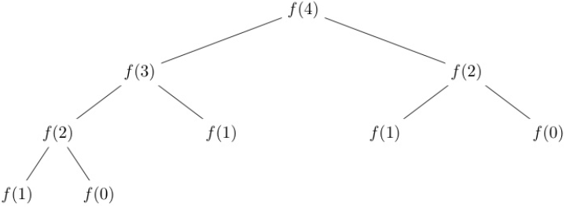
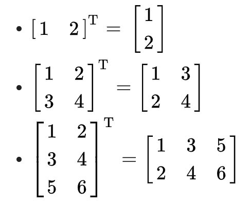
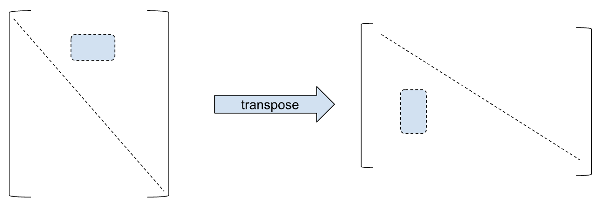

[](https://classroom.github.com/a/HCv3xlSW)
# Profiling and Optization in C

<!--- Your assignment is available [here](https://docs.google.com/document/d/1kOhoFgHsBoYxjZ5PH2p6fkeyyXgUjJiY5kCgg-nI248/edit?usp=sharing). --->


## Introduction

This assignment has 6 parts, and each of the 6 parts is focused on optimizing a program that is given to you. You'll apply the optimization techniques you have learned in order to speed up a program anywhere from 1.5X to 100X. While it's not very often that you have to hand code assembler in order to speed up a program, it is still very common to **optimize your C code** to make it run faster.

Sometimes, it is just not very obvious where your program is slow. Rather than guess what is slow and what is fast, you should first figure out what is slow. It's usually where the program spends most of its time. Programmers use tools called **profilers** in order to get a trace of where the program is spending most of its time, and then optimize that in a targeted way. Targeting your optimizations toward critical pieces of slow code is an excellent way of getting a lot of bang for your buck.

This exercise will work on both Linux and MacOS, though MacOS involves installing two more tools. We will get into that later.


## Task 1. Algorithmic Optimization


### Fibonacci

You should be familiar with the [Fibonacci](https://en.wikipedia.org/wiki/Fibonacci_number) sequence. This is one of the favorite algorithms taught when students learn recursion. Fibonacci is defined as

```
fib(0) = 0
fib(1) = 1
fib(n) = fib(n - 1) + fib(n - 2) for n > 1
```

Writing Fibonacci the standard recursive way gives you this call tree. You can see that values that were computed previously like fib(2) in the left hand tree are recomputed again in the right hand trees.





### Oddinacci

The Oddinacci sequence is similar to the Fibonacci sequence, except that it behaves a little differently when the number is odd


```
    oddinacci(0) = 0
    oddinacci(1) = 1
    oddinacci(n) = oddinacci(n - 1) + oddinacci(n - 2) when n is even
    oddinacci(n) = <em>oddinacci(n - 1) + oddinacci(n - 2) + oddinacci(n - 3) when n is odd
```

It's simple enough to write a recursive version of oddinacci.  This is the function you are given.
```
    long oddinacci(long n) {
        if (n == 0 || n == 1) {
            return n;
        } else if (n % 2 == 0) {
            return oddinacci(n - 1) + oddinacci(n - 2);
        } else {
            return oddinacci(n - 1) + oddinacci(n - 2) + oddinacci(n - 3);
        }
    }
```

It takes a while to run for large `n`, as you expect.


### Memoization

The recursive approach is super slow. Your first task is to implement <strong><code>oddinacci_fast</code></strong>, which produces the same answer as <code>oddinacci</code>, but is many many times faster. It should be at least 100 times faster. On my machine at home, it is 20,000 times faster for <code>oddinacci(45)</code>.

The recursive algorithm for Oddinacci starts at `n` and breaks the problem down into Oddinacci for `n - 1`, `n - 2`, and if n is odd, `n - 3`. Just like Fibonacci, it recomputes values that were already computed in previous recursive calls.

Rather than go top down, we can go bottoms up, and _remember_ the values that are already computed.  When you want to compute oddinacci of a number n, you should


1. Initialize an array of size `n + 1`
2. Set `array[0]` to be `0`. This represents `oddinacci(0)`.
3. Set `array[1]` to be `1`. This represents `oddinacci(1)`.
4. Then iterate with an index `i` from `2` upwards to `n`.
    1. Compute `oddinacci(i)` from the numbers already computed that are smaller than `i`.
5. If you malloc'd any memory, free the memory you previously allocated when you are done. If you don't free the memory, then your `oddinacci_fast` function will have a memory leak each time it is called.

This is a very powerful technique called [memoization](https://en.wikipedia.org/wiki/Memoization#:~:text=In%20computing%2C%20memoization%20or%20memoisation,the%20same%20inputs%20occur%20again.), or dynamic programming. You are trading off storage for computation. If you did this correctly, you should get an impressive speedup.

The lesson here is that algorithmic speedups are usually much more effective than other optimizations.


### Testing

The functions are in **oddinacci.c** and **oddinacci_main.c.** You can run the program with

```
	make
	./odd
```


The automated test is run with
```
make test-odd
```
This will run a set of tests on <strong><code>oddinacci()</code></strong> and <strong><code>oddinacci_fast()</code></strong>, and time how long it takes to run both. Your oddinacci_fast must produce the same result as oddinacci, and run at least 100 times faster.


## Task 2. Profiling and Matrix Optimization

Sometimes there are no algorithmic optimizations possible and you need to figure out why a program is running slowly. In this task, we are going to look at how to optimize a loop.

You're given an abstract data type for a 2D matrix as specified in matrix.h.


```
    // Define an abstract data type for a matrix
    typedef struct mat* matrix_t;

    // Initialize a matrix of the given dimension, with all values set
    // to a predefined set of values.
    // Type defines the type of the matrix. There are 3 types, 0, 1 and 2.
    void matrix_init(matrix_t* mat, int rows, int cols, int type);

    // Free memory allocated to previously initialized matrix
    void matrix_free(matrix_t mat);

    // Return the number of rows of the matrix
    int matrix_rows(matrix_t mat);

    // Return the number of columns of the matrix
    int matrix_cols(matrix_t mat);

    // Retrieve an element at the given row and col
    int matrix_get(matrix_t mat, int row, int col);

    // Set the matrix value at the given row and col.
    // Return the value that was set.
    int matrix_set(matrix_t mat, int row, int col, int value);
```


These are library functions, and you are given the obfuscated implementation in `matrix.c` that implements these functions, so you cannot see what the functions are doing -- unless you wish to exercise your assembler and disassembler skills, but you really shouldn't for this exercise. Most programmers don't prefer to dive into assembler if they can help it.

In the function <strong><code>mat0_slow() </code></strong>in <strong>mat0.c</strong>, you're given a function that computes the sum of all elements of a given matrix. The matrix is of type 0, as you can see in the initialization code in the main function.


```
    long mat0_slow(matrix_t mat) {
        long sum = 0;
        for (int i = 0; i < matrix_rows(mat); i++) {
            for (int j = 0; j < matrix_cols(mat); j++) {
                int value = matrix_get(mat, i, j);
                printf("%d ", value);
                sum += value;
            }
            printf("\n");
        }
        return sum;
    }

    long mat0_fast(matrix_t mat) {
	    return 0;
    }

    int main() {
        // Create a type 0 matrix
        long val1 = 0;
        matrix_t mat;
        matrix_init(&mat, 10, 10, 0);
        double slow = measure_mat(mat0_slow, mat, &val1);

        long val2 = 0;
        matrix_init(&mat, 10, 10, 0);
        double fast = measure_mat(mat0_fast, mat, &val2);

        printf("slow=%f, fast=%f\n", slow, fast);
        printf("Speedup=%f\n", slow / fast);
    }
```


It basically iterates over all elements and sums them up. It also runs really slowly.  The measure_mat function measures how long the function takes to run.

Your job is to write <strong><code>mat0_fast()</code></strong>, the faster version of this. Initially, you can see how it works by compiling and running:

```
	make mat0
	./mat0
```


### Profiling

In order to figure out what is running slowly, programmers use [profiling tools](https://en.wikipedia.org/wiki/Profiling_(computer_programming)). These tools instrument your code by automatically inserting counters in every function so that you can see where the majority of the program spends its time.

### Linux
The standard tool used in Unix is [gprof](https://man7.org/linux/man-pages/man1/gprof.1.html), the GNU profiler. Using it is pretty simple. If you have a program foo.c, you compile it with the `-pg` flag.
```
	gcc -pg foo.c -o foo
```
The command line above will produce an executable called foo. Now run foo with whatever arguments it expects.
```
	./foo arg1 arg2
```
This will produce a file called gmon.out, which is a profile and trace of the execution of foo. Now you can view the analysis with
```
	gprof foo gmon.out
```
Your task is to profile <strong><code>mat0_slow()</code></strong> and figure out why it is slow. Then write the faster version of the same function in <strong><code>mat0_fast()</code></strong>. You should be able to speed it up by at least a factor of 10.


#### <span style="text-decoration:underline;">Hint</span>:

You must **rebuild or compile everything that you want to profile in your program with the -pg option** if you want to use the profiler. If you just add -pg to the Makefile, constituent .o's that were previously built will not be automatically rebuilt. For mat0, the command is: `gcc -pg -o mat0 mat0.c mat0_main.c matrix.c measure.c`

### MacOS
Unfortunately gprof doesn't run directly on the Mac. 
There are three ways to do deal with this. The first is to use the lab machines which run Linux.
The second is Docker, and the third is using Google's Mac perf tools.

#### Docker on Mac
Install Docker on Mac, then run
```
  make run-on-docker
```

This will drop you into a Linux environment on Mac, which you can then use to run gprof.

#### Google Perf Tools on Mac
If you want to run on Mac directly, then there are alternatives.
The easiest to use is Google's perf tools and jeprof. Install these with
```
  brew install gperftools
  brew install jemalloc
```

You must recompile everything with the `-lprofiler` flag to use the profiler. If you want to profile `foo.c`, then the command is:
```++
	gcc foo.c -o foo -lprofiler.
```

Now if your executable is `foo`, run the executable like this:
```
    CPUPROFILE=foo.prof ./foo
```
This will run the program `foo` and produce an output file called `foo.prof`, which is a profile and a trace of the execution of foo.

Now you can view the analysis with
```
    jeprof --text foo foo.prof
```
This will give a breakdown of the functions called and the percentage of time spent in each function. You should be able to see what is slow.

#### <span style="text-decoration:underline;">Hint</span>:

You must **rebuild or compile everything that you want to profile in your program with the -lprofiler option** if you want to use the profiler. For mat0, the command is: `gcc -o mat0 mat0.c mat0_main.c matrix.c measure.c -lprofiler`.

### Testing

**mat0.c** is paired with **mat0_main.c** for a test program. You can run a test program with

```
	make mat0
	./mat0
```


The automated test is run with
```
	make test-mat0
```

## Task 3. Profiling and Matrix Optimization Redux

The matrix class operates differently when it is of type 1. It behaves entirely differently than when it is of type 0, with slowdowns in different places. You are given <strong><code>mat1_slow()</code></strong> in <strong><code>mat1.c</code></strong>, with the associated main in <strong><code>mat1_main.c</code></strong>.

Use the GNU profiler now to determine how to speed up <strong><code>mat1_slow()</code></strong>. Implement <strong><code>mat1_fast()</code></strong>. You should be able to get a speedup of at least 1.5.


### Testing

**mat1.c** is paired with **mat1_main.c** for a test program. You can run the test program with
```
	make mat1
	./mat1
```


The automated test is run with
```
	make test-mat1
```

## Task 4. Profiling and Matrix Optimization Revolutions

The matrix class operates differently when it is of type 2 yet again. It behaves entirely differently with slowdowns in different places. You are given <strong><code>mat2_slow()</code></strong> in <strong><code>mat2.c</code></strong>, with the associated main in <strong><code>mat2_main.c</code></strong>.

Instead of matrix multiplication this time, this code calculates the [determinant](https://www.mathsisfun.com/algebra/matrix-determinant.html) of a matrix using a [recursive Laplace expansion](https://en.wikipedia.org/wiki/Laplace_expansion). Google for how it's calculated. This one is a little trickier. You've going to have to be creative in how you get a speedup.

**Note that your solution must work and be fast for any size matrix. It is insufficient to hard code for the number of rows or columns. Don't do code like this below:**


```
    if (matrix_rows(mat) == 2) {
        ...
    }
```
or
```
    if (matrix_rows(mat) == 3) {
        ...
    }
```

The only exception is to check for matrices of size 1x1.

Use the GNU profiler now to determine how to speed up <strong><code>mat2_slow()</code></strong>. Figure out what is slow, and target that for speedup by implementing <strong><code>mat2_fast()</code></strong>. You should be able to get a speedup of at least 2.0.

You may find it useful to look at the call graph for `mat2`. The `gprof` argument to use is `--graph`. Read the man page for gprof for details.


### Testing

**mat2.c** is paired with **mat2_main.c** for a test program. You can run the test program with
```
	make mat2
	./mat2
```


The automated test is run with
```
	make test-mat2
```

## Task 5. Matrix Transposition and Locality
The transpose of a matrix $A$, denoted by $A^T$, may be constructed by any one of the following methods:
- Reflect $A$ over its main diagonal (which runs from top-left to bottom-right) to obtain $A^T$
- Write the rows of $A$ as the columns of $A^T$
- Write the columns of $A$ as the rows of $A^T$

Here are some examples:



In general, this equivalence holds: $A_{i,j} = {A^T}_{j,i}$. That is, the element at the $i$<sup>th</sup> row and $j$<sup>th</sup> column of the matrix
$A$ is equal to the element at the $j$<sup>th</sup> row and $i$<sup>th</sup> column of $A^T$.
This leads to a very simple implementation of the transpose function which takes a `src` matrix and computes the destination `dst` as its transpose:
```
For i in all rows in src
    For j in all columns in src
        dst[j][i] = src[i][j]
```

### Functions
In this task, matrices are defined as an array of integers of some number of rows and some number of columns.
A matrix is represented as a straightforward array `int matrix[ROWS * COLS * sizeof(int)]`.
You retrieve the entry at row `i` and column `j` with `int entry = mat[i * cols + j]`.

You initialize a matrix with `void transpose_fill(int* matrix, int rows, int cols)` which fills the matrix with random values.

You're given a naive and slow implementation `void transpose_slow(int* src, int rows, int cols, int* dst)`. This function computes the transpose of `src`
which is a matrix of size `rows` and `cols`, and puts the result in `dst`. `dst` should have been allocated already before this function is called.

Your job is to write `void transpose_fast(int* src, int rows, int cols, int* dst)`.

### Testing
**transpose.c** is paired with **transpose_main.c** for a little test program you can run.
```
  make transpose
  ./transpose
```

The automated test is run with
```
  make test-transpose
```

You need to get a speedup of at least 2 to pass this test.

There is a helpful `void print_mat(int* matrix)` function which is useful when you're debugging your code with smaller matrices.

### Hint
This part of the assignment is all about locality. The naive implementation jumps over huge strides when it does transposition -- so your solution should take advantage of
locality. So note that **elements which are close together in the `src` matrix are also close together in the `dst` matrix**, except of course one is close row-wise
and the other is close column-wise. The image above illustrates this.

You can still use this information to improve locality.

Lastly, remember that the cache line size is anywhere from 64 bytes to 128 bytes on current CPUs.

## Task 6. Hash Tables, Linked Lists and Locality
You probably learned that hash tables are great for $O(1)$ lookup, at the expense of greater complexity
with linked lists often used to handle collisions.
However, hash tables are also great **destroyers of locality**.
Consider what happens when you add a key/value pair to a linked list. Good hash functions will space out keys far away from each other in order to avoid collisions.

This situation is exacerbated when linked lists are used to hold key/value pairs that
collide at the same index. Since a key can be hashed to
any index, successive items in the linked list will not be close to each other in memory. Lookups that traverse a linked list therefore involve random memory accesses, leading to frequent cache misses.

For example, consider a sequence of keys $K_1, K_2, ..., K_n$ that are inserted into a hash table using linked lists to handle collisions. Suppose that $K_1$ is hashed to index $42$ and is the first item hashed to that location. It becomes the first node in the linked list at index $42$. This node is held in memory allocated for it with `malloc`.

It is likely that subsequent keys $K_2, K_3, ..$ etc will hash to different indices. It will likely be a long time before some key $K_j$ hashes to same index $42$. When key $K_j$ is inserted into the list, it will be held in memory allocated with `malloc` quite far away from the memory that holds the initial $K_1$.

This means that traversing the linked list to find a key will result in memory accesses that are spaced very far apart.

## You're Given
### Linked List
You are given a simple linked list implementation in **list.h** and **list.c**.
```
// The node holds a linked list of key/value pairs
typedef struct node {
    int key;
    int value;
    struct node* next;
} node_t;


// A linked list has a head and a tail
typedef struct list {
    node_t* head;
    node_t* tail;
} list_t;
```

This is just a simple linked list. You are also given these linked list functions.
```
// Free the list and all associated nodes
void list_free(list_t* list);

// Add the value to the end of the list
void list_add(list_t* list, int key, int value);

// Lookup the key in the list. Return true on success or false on failure.
// The value is set in *pvalue.
bool list_lookup(list_t* list, int key, int* pvalue);
```
These are all written for you. Go ahead and examine the code. It is a standard linked list.

### Hash Table
You're also given a hash table implementation in **hashtable.h** and **hashtable.c**.
```

// A hash table
typedef struct {
    int size;                               // size of the table
    list_t** data;                          // the array of lists itself
    void (*listfree)(list_t*);              // the function used to free a list
    void (*listadd)(list_t*, int, int);     // the function used to add data to a list
    bool (*listlookup)(list_t*, int, int*); // the function to lookup keys in a list
} hashtable_t;
```
The hash table is of a certain `size` and also holds an array of lists in the `data` field.
The other fields hold a set of functions that the hash table uses to operate on lists.
As you can see, the structure holds function pointers to free lists, add lists and
to lookup keys in lists.
There is no need to have a function to create a list, since the empty list is just a pointer to `NULL`.
When we create a hash table, we pass these list functions to hashtable_init so that the hash table
knows what functions to call to manipulate lists. The `hashtable_init` function is shown below.
```
// Initialize a hash table of the given size.
// The hash table can operate on multiple kinds of lists, and needs to know
// what the functions to create, add and free lists are.
hashtable_t* hashtable_init(
    int size,
    void (*listfreefunc)(list_t*),
    void (*listaddfunc)(list_t*, int, int),
    bool (*listlookupfunc)(list_t*, int, int*)
);
```

There is a small main program in **hashtable_main.c** where you can see how hash tables are created
using this init function.

### Your Task
The `main` program in **hashtable_main.c** creates a hash table and adds a whole
bunch of key/value pairs to it.
Then the program checks that every key it added is actually found and matched to the correct key.
This of course requires hashing the key to the correct index, and then traversals of the
linked lists to match keys. Looking up items in linked lists that are connected in random memory locations is very inefficient.

Your task is to write a **fast implementation of lists**. The functions are defined in **list.h**
and you should implement them in **list.c**. This involves defining `fastnode_t` and `fastlist_t`,
and then writing the functions listed below:
```
// A fast linked list. This is the equivalent of the linked list above and is
// intended to be used as a drop in replacement for linkedlist_t in hashtable_t

// A fast node uses an array of values to stay within
typedef struct fastnode {
    // Your code here
} fastnode_t;

// Free the fast list and all associated nodes
void fastlist_free(fastnode_t* fastlist);

// Add the value to the end of the list
void fastlist_add(fastnode_t** fastlist, int key, int value);

// Lookup key in the list and set *pvalue to the associated value if found.
// Return true on success or false on failure.
bool fastlist_lookup(fastnode_t* fastlist, int key, int* pvalue);
```

The `fastlist_t` functions are direct analogs of the `list_t` functions.
Since these functions have arguments in the same order and same size, we can
drop them in as replacements for the `list_t` functions in the hash table implementation.
You can see how this is done in the `main` program in **hashtable_main.c** when
the code initializes the fast hash table.

The `fastlist_t` functions should work a lot better than the `list_t` functions by
considering locality -- in particular, we want **successive items in the linked list
to be close together** so that traversing the linked list is fast.

### Testing
You can create the small standalone test program and run it with
```
make hashtable
./hashtable
```

You can run the actual test code with
```
make test-hashtable
```
You must achieve a speedup of at least 1.5 times to pass this part, and your solution must use
`fastnode_t`. I'm able to easily get more than 2.8X speedup on my computer.

### Hint
Of all the data structures you've studied, only one really guarantees that successive items are
close together.
That is the **array**.
But you don't want to just allocate a giant array either. That is very wasteful of space.
This is enforced by a check in the test code that `fastnode_t` can't be very large,
and by requiring that you use `smallmalloc` to allocate objects. This is given to you
in **smallmalloc.h** and **smallmalloc.c**. It's just a wrapper around `malloc` that limits
the maximum allocation size.
If you try to use `malloc`, even in comments, the test code will fail.

Again, remember that cache line sizes aren't very big.
